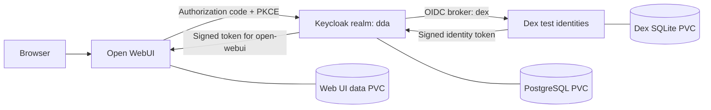

# DDA identity and Open WebUI lab

A runnable Mac Docker lab and a native OpenShift deployment kit for **Dex → Keycloak (`dda`) → Open WebUI**. Dex supplies five local test identities. Keycloak brokers Dex and acts as the sole OIDC issuer trusted by the dedicated Open WebUI client. Headroom remains an independent local Codex utility.



## Experience it locally

- [Open WebUI](http://webui.localhost:3000): **Continue with DDA SSO → Dex login form**.
- [Keycloak administration](http://keycloak.localhost:8080/admin/): username `admin`.
- [DDA account console](http://keycloak.localhost:8080/realms/dda/account/).
- [Dex discovery](http://dex.localhost:5556/dex/.well-known/openid-configuration).
- Passwords: `.runtime/TEST-USERS.md` (private and excluded from Git).

The identities are `testuser01@dda.test` through `testuser05@dda.test`. Full names are inherited from Dex with no second profile form. Later logins reuse the Keycloak SSO session. Dex is an identity service, not a general user-management dashboard.

## Reproduce

Prerequisites: Docker Desktop (8 GB Docker memory recommended), Python 3, and an available browser. This Mac is AMD64. Use modern Chrome/Chromium for `.localhost` subdomain resolution; container DNS aliases are defined in Compose. For shell tools that do not resolve `.localhost`, use `curl --resolve keycloak.localhost:8080:127.0.0.1 ...`.

```sh
python3 scripts/bootstrap.py
# A fresh machine needs the external volume expected by the existing Web UI deployment:
docker volume create open-webui
scripts/local.sh up -d
scripts/local.sh ps
```

Bootstrap generates secrets only once and pre-provisions the dedicated federated administrator in a fresh Keycloak realm. Fresh Web UI databases also receive a separate break-glass administrator before any SSO user can sign in. Running it again preserves credentials. **Use `scripts/local.sh` for this identity stack**, so both Compose files and its private environment are loaded. Running plain `docker compose up` only loads the earlier Web UI/Headroom configuration.

Keycloak imports the realm on the first database boot. An existing realm is not overwritten on restart. See `keycloak/README.md` for change management. Existing Open WebUI accounts/data are retained; the five demo identities inherit ordinary access from the Keycloak `openweb-users` group; `openwebui-admins` grants WebUI administrator access.

## Repository layout

| Folder/file | Purpose |
|---|---|
| `dex/` | Upstream OIDC provider and identity lifecycle |
| `keycloak/` | Broker, realm/client template, optimized image |
| `postgresql/` | Keycloak database and recovery |
| `open-webui/` | SSO settings and arbitrary-UID image |
| `headroom/` | Existing local Codex proxy documentation |
| `openshift/reference/` | Committed native resource examples with placeholder secrets |
| `scripts/` | Bootstrap, rendering, verification, image transfer, backup |
| `docs/` | Architecture, air-gap operations, recovery |
| `.runtime/` | Private generated credentials/configuration and offline archives; ignored |
| `verification/` | Sanitized test results and preview images |

## OpenShift and air gap

Start with `docs/AIRGAP.md` and `openshift/README.md`. Supply your real OpenShift version, registry, domain, storage class, ingress CA, and model-provider endpoint. The committed reference uses `apps.example.internal` and `registry.example.internal/dda`; **do not apply its placeholder Secrets**. Render fresh private resources for each environment.

The manifests target native OpenShift APIs and restricted SCC behavior, with HTTPS edge Routes, probes, resource requests, NetworkPolicies, and PVCs. This is a single-replica reference, not an HA or compliance certification. No enterprise cluster was contacted or modified; real SCC, admission, CA trust, DNS, storage, backup restore, and login validation must pass on your target cluster.

## Seamless onboarding

Dex profiles are Alex Morgan, Jamie Parker, Taylor Reed, Jordan Blake and Casey Brooks (`testuser01`–`testuser05`, with matching `@dda.test` email addresses). Open WebUI sends `kc_idp_hint=dex`, so the Keycloak selection page is skipped. Keycloak's `dda-first-broker-login` flow creates only unique upstream identities; matching existing accounts require explicit administrator resolution, never silent linking. The broker imports and refreshes names/emails from Dex.

For a fresh bootstrap run `python3 scripts/onboard-test-users.py` to exercise all five browser logins, and `python3 scripts/verify-group-inheritance.py` to demonstrate group-based promotion, demotion and denial. `python3 scripts/sync-keycloak.py` reconciles the local broker flow after a source change; realm startup import alone does not update an existing database.

## Administration and demo

A dedicated `admin@dda.test` identity administers Open WebUI and the Keycloak `dda` realm through SSO. Master Keycloak and PostgreSQL use separate generated administration credentials. See `.runtime/ADMIN-ACCESS.md` privately and the non-secret [administration guide](docs/ADMINISTRATION.md). Existing administrators are retained. Follow [the complete demo](docs/DEMO.md); screenshots and checks are in `verification/`.

For enterprise acceptance and remaining cluster-dependent gates, see [production readiness](docs/PRODUCTION-READINESS.md).

## Editable architecture

[Four-page Draw.io document](architecture/dda-sso-architecture.drawio) and [SVG previews](architecture/README.md) cover the deployed Mac stack, detailed SSO sequence, air-gapped OpenShift reference, and identity/operations inventory.

Manage group membership in Keycloak **dda → Users → user → Groups**. Permissions are inherited on the next SSO login; existing sessions need separate revocation for urgent removal. See [Keycloak authorization](keycloak/README.md#group-based-open-webui-authorization).
