# DDA SSO configuration guide

A screenshot-backed administrator runbook for **Dex → Keycloak → Open WebUI**, captured from the local Mac deployment on **14 September 2026**. Keycloak is **26.7.3**, Dex is **v2.45.1** with the documented username adapter, and Open WebUI is **v0.11.3**.

The screenshots show the running local lab, not an OpenShift deployment. Secret fields were masked in the browser before capture; no passwords, client secrets, signing keys, tokens, or personal account details belong in this guide. The yellow Keycloak banner identifies the temporary bootstrap administrator used for the local demonstration. Replace bootstrap administration with approved named administrators and MFA before enterprise use.

Use the [exact non-secret runtime configuration](configuration/local-effective-config.json) alongside this guide. Screenshots are point-in-time evidence; Git-managed generators and manifests define reproducible deployment behavior. Existing account lists and memberships can change as administrators use the demo.

## 1. Architecture and configuration ownership

| Component | Responsibility | Local address | Persistent configuration |
|---|---|---|---|
| Dex | Authenticates the upstream identity and supplies subject, name and email | `http://dex.localhost:5556/dex` | [Generator](../scripts/bootstrap.py), private `.runtime/dex/config.yaml`, [custom login template](../dex/theme/password.html) |
| Keycloak | Brokers Dex, owns the `dda` realm, group membership and application roles | `http://keycloak.localhost:8080` | PostgreSQL; [realm generator](../scripts/bootstrap.py), [live reconciliation](../scripts/sync-keycloak.py) |
| Open WebUI | Relying party; consumes Keycloak's signed identity and roles | `http://webui.localhost:3000` | Existing `open-webui` volume; [identity Compose environment](../compose.identity.yaml) |
| PostgreSQL | Persists Keycloak realm, users, links, groups, keys and sessions | Internal Docker network, port 5432 | `keycloak-db-data` volume; [database README](../postgresql/README.md) |
| Headroom | Separate Codex token-compression utility | `http://localhost:8787` | Separate service and volume; not part of the SSO trust chain |

The browser starts an authorization-code flow with PKCE to Keycloak. `kc_idp_hint=dex` selects the upstream provider directly. Dex verifies the password, Keycloak validates the broker response and issues its own token, and Open WebUI applies the `roles` claim. The application never needs a second copy of the user's Dex password.

See the [editable four-page architecture](../architecture/dda-sso-architecture.drawio) and [SSO/authorization diagram](../architecture/02-sso.svg).

## 2. Administrator entry points

| Purpose | How to enter | Account source |
|---|---|---|
| Server-wide Keycloak configuration | Open `http://keycloak.localhost:8080/admin/`, then select realm **dda** through **Manage realms** | Separate `master` administrator; private `.runtime/ADMIN-ACCESS.md` |
| Delegated `dda` administration | Open `http://keycloak.localhost:8080/admin/dda/console/` | Dedicated Dex administrator, separately granted `realm-management/realm-admin` |
| Open WebUI administration | Sign in with **Continue with DDA SSO**, then user menu → **Admin Panel** | Membership in `openwebui-admins` grants the application administrator role |
| Dex configuration | Review private generated config and its source generator | Dex has no built-in administration web console |

Selecting a realm is essential: configuring `master` does not configure `dda`. Database record UUIDs in console URLs are installation-specific; follow the named menus below instead of copying another deployment's UUID-based URL.

## 3. Keycloak realm: general and login policy

Navigate to **dda → Realm settings → General**.

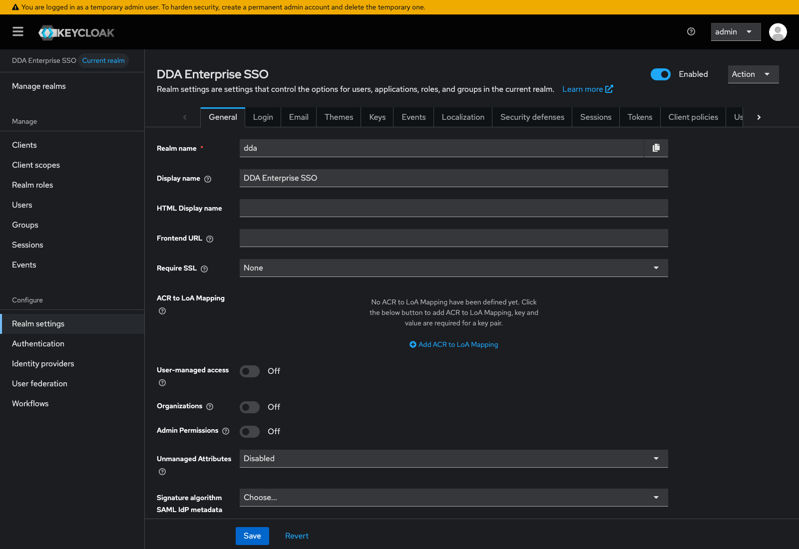

| Setting | Local configuration | Enterprise interpretation |
|---|---|---|
| Realm / display name | `dda` / `DDA Enterprise SSO` | Application-specific realm |
| Enabled | On | Keep realm enabled |
| Require SSL | `None` in the loopback HTTP demo | The OpenShift generator uses `external`; Routes use HTTPS and redirect HTTP |
| User-managed access / organizations | Off | Not required for this brokered login |
| Frontend URL | Empty | The container's configured hostname establishes the public Keycloak URL |

The local `sslRequired=none` override is explicit in `scripts/bootstrap.py`; do not copy it into enterprise configuration. Source: [bootstrap.py](../scripts/bootstrap.py), [Keycloak container configuration](../compose.identity.yaml), [OpenShift generator](../scripts/render-openshift.py).

Navigate to **Realm settings → Login**.

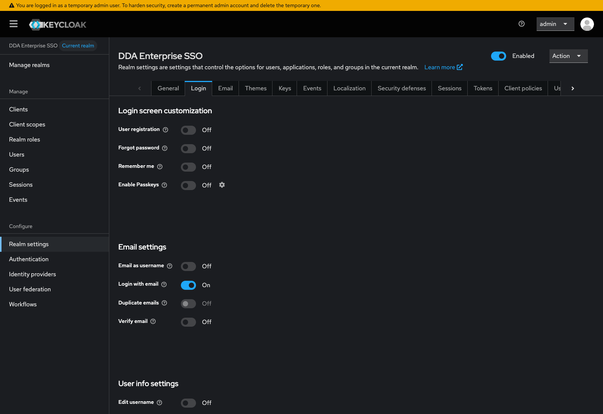

Self-registration and reset-password are disabled in this lab. Login with email is enabled; duplicate emails are disallowed. Dex owns the upstream password. Keycloak's local login policy does not create a Dex password-reset service.

### Session and token lifetimes

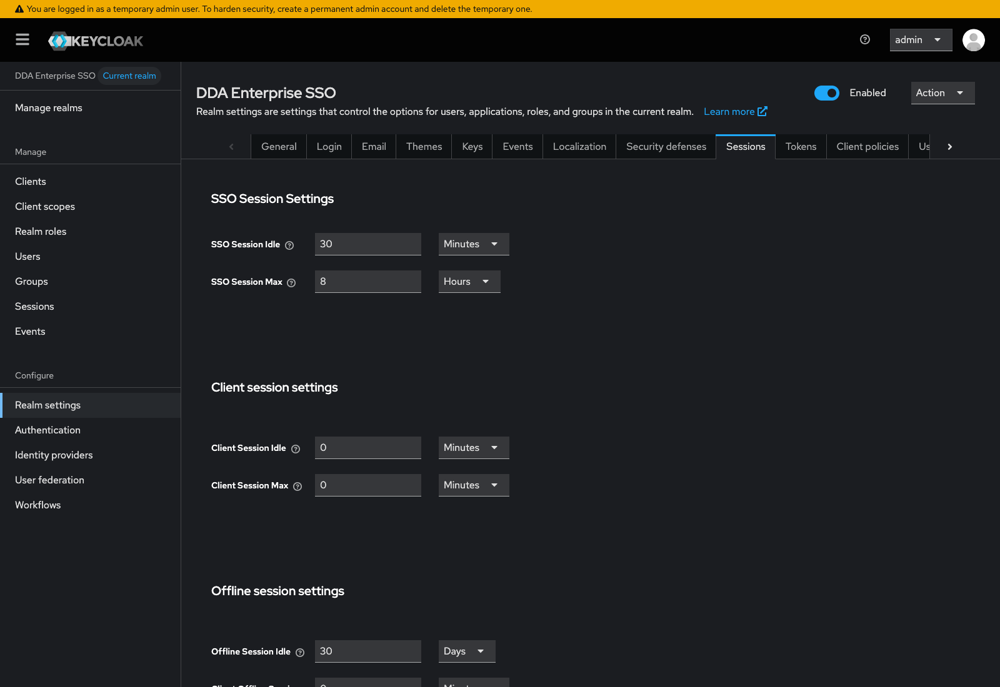

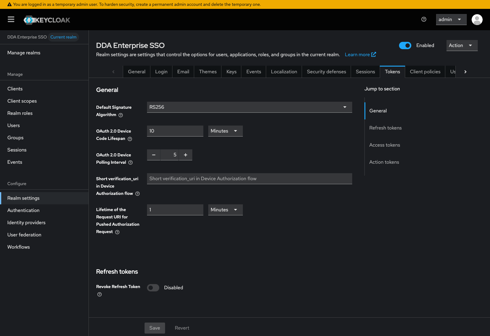

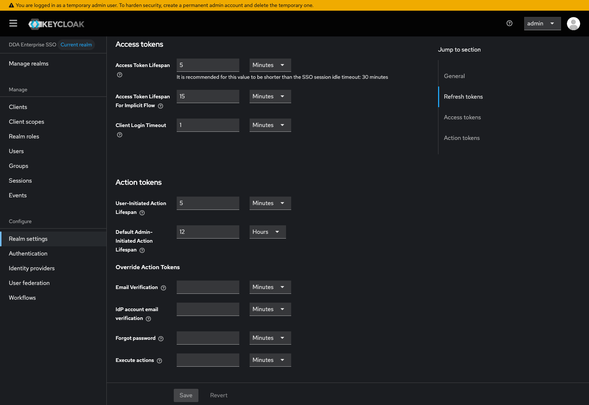

| Setting | Configured value |
|---|---|
| Access token lifespan | 300 seconds / 5 minutes |
| SSO session idle timeout | 1,800 seconds / 30 minutes |
| SSO session maximum lifespan | 28,800 seconds / 8 hours |

These are Keycloak lifetimes. Open WebUI also has its own application session lifetime; shortening a Keycloak access token does not automatically revoke every existing WebUI session.

### Headers and brute-force detection

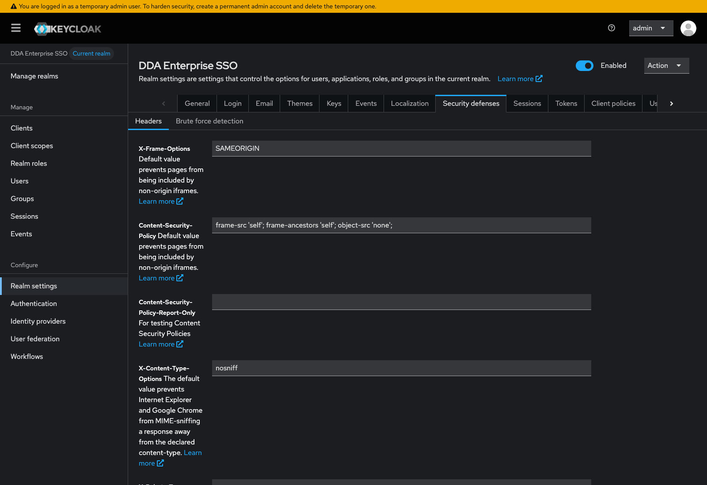

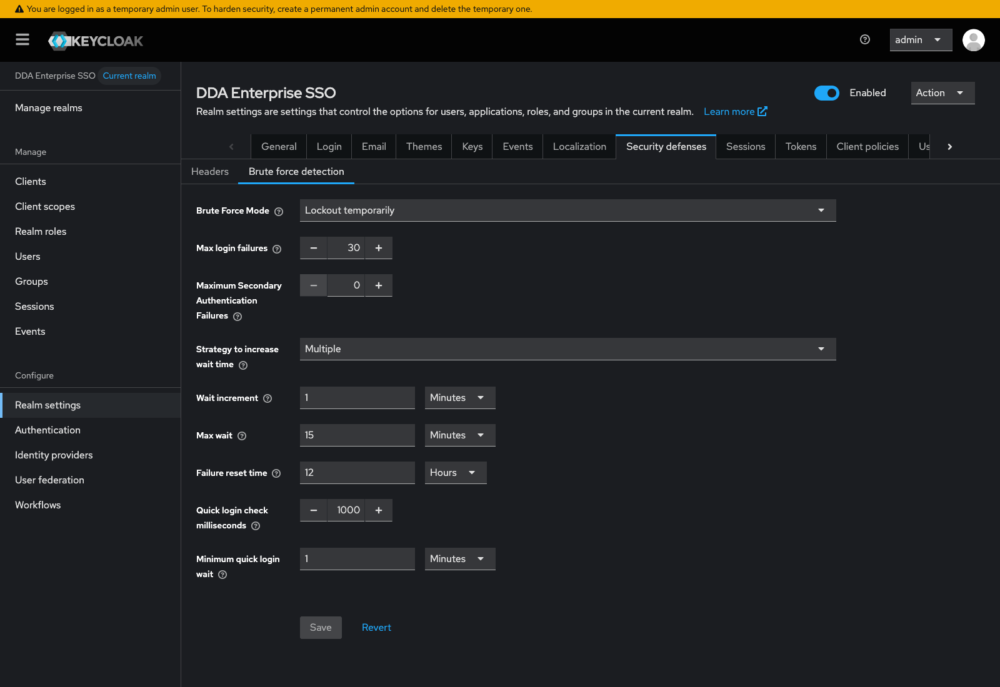

Brute-force protection is enabled. The captured policy uses temporary lockout, 30 failures, a one-minute wait increment and a 15-minute maximum wait. Exact non-secret values are in the runtime reference. Security headers include frame restrictions, `nosniff`, and a referrer policy.

Keycloak brute-force controls are not a substitute for controls at the upstream password provider. The local Dex static-password fixture does not represent enterprise MFA, directory lockout or rate-limit policy. Validate these at the real enterprise identity source and ingress layer.

## 4. Keycloak identity provider: Dex broker

Navigate to **dda → Identity providers → DDA Test Identities → Settings**.

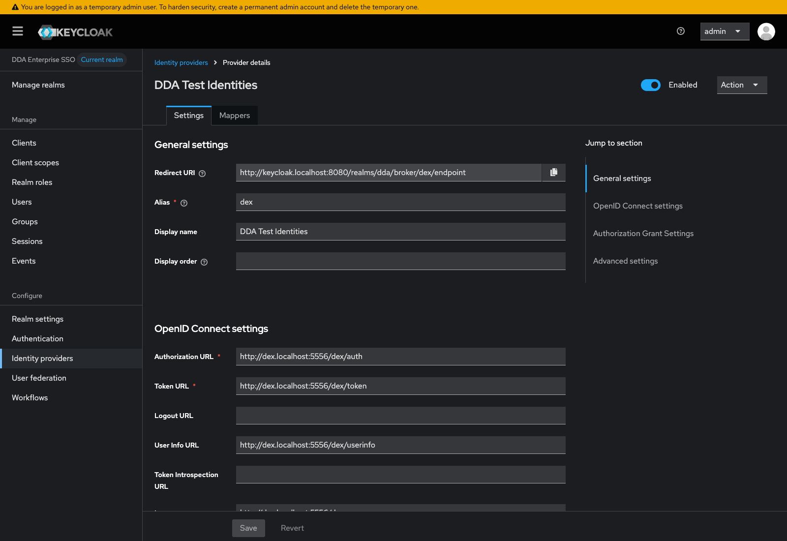

| Field | Local value |
|---|---|
| Provider type | OpenID Connect |
| Alias / display name | `dex` / `DDA Test Identities` |
| Redirect URI registered in Dex | `http://keycloak.localhost:8080/realms/dda/broker/dex/endpoint` |
| Authorization URL | `http://dex.localhost:5556/dex/auth` |
| Token URL | `http://dex.localhost:5556/dex/token` |
| User Info URL | `http://dex.localhost:5556/dex/userinfo` |
| Issuer | `http://dex.localhost:5556/dex` |
| JWKS URL | `http://dex.localhost:5556/dex/keys` |
| Client ID | `keycloak-dda` |
| Client secret | Same generated `DEX_CLIENT_SECRET` on the Keycloak broker and Dex static client; never copy it into documentation |

The browser, Keycloak and Dex must agree on the public issuer. Docker service aliases make the same `.localhost` hostnames resolvable inside the Docker network. For OpenShift, replace these with the generated HTTPS Route hostnames, trusted enterprise CA, and reachable pod-to-Route networking.

### Signature validation and PKCE

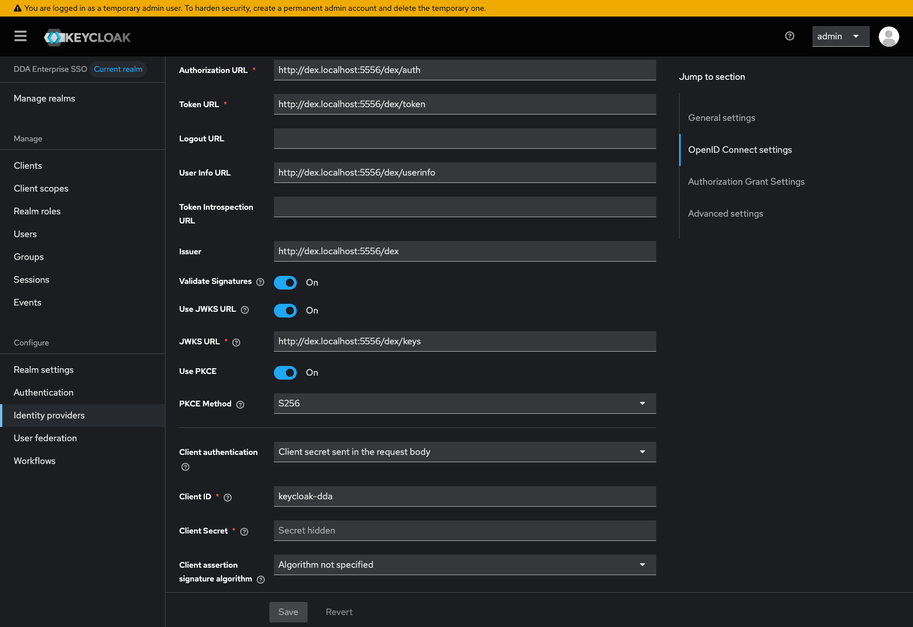

**Validate Signatures** and **Use JWKS URL** are on. **Use PKCE** is on with **S256**. Scope is `openid email profile`. These controls apply to the Keycloak-to-Dex authorization flow, in addition to PKCE on the WebUI-to-Keycloak flow.

### Profile provisioning and synchronization

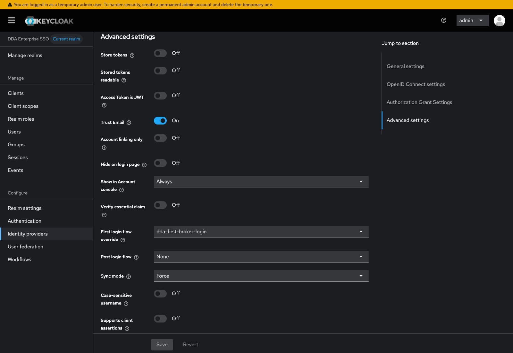

| Setting | Value | Effect |
|---|---|---|
| Store tokens | Off | Does not retain upstream tokens for application use |
| Trust email | On for controlled synthetic identities | Accepts the test IdP's email claim; reassess this trust for a real connector |
| First login flow override | `dda-first-broker-login` | Provisions a unique broker identity without a second profile form |
| Sync mode | `FORCE` | Refreshes brokered profile information from the upstream IdP |

Navigate to **dda → Authentication → dda-first-broker-login**.

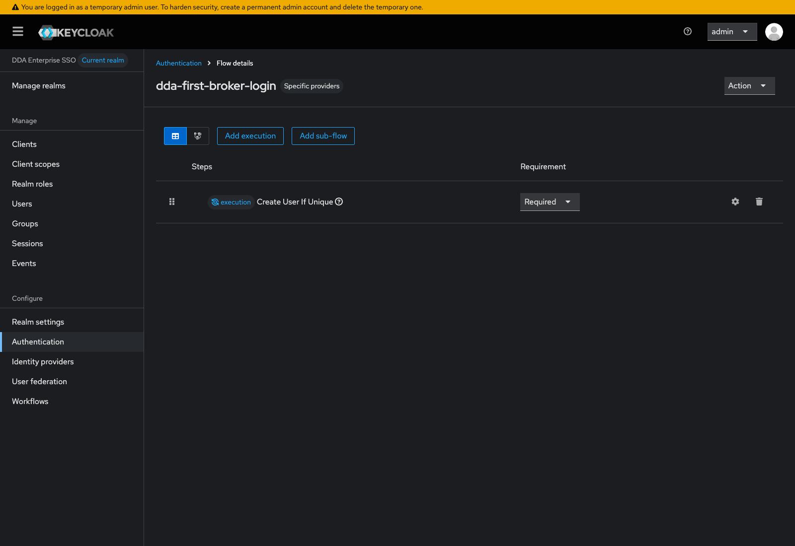

The flow contains **Create User If Unique** as **Required**. It omits Review Profile. Stable Dex subjects and complete `name`/`email` claims avoid a second details form. This deliberately does not silently attach a new upstream identity to an existing account with a matching email. Resolve a collision by verifying the identity link; do not enable blanket email merging as a shortcut.

## 5. Keycloak client: Open WebUI

Navigate to **dda → Clients → open-webui → Settings**.

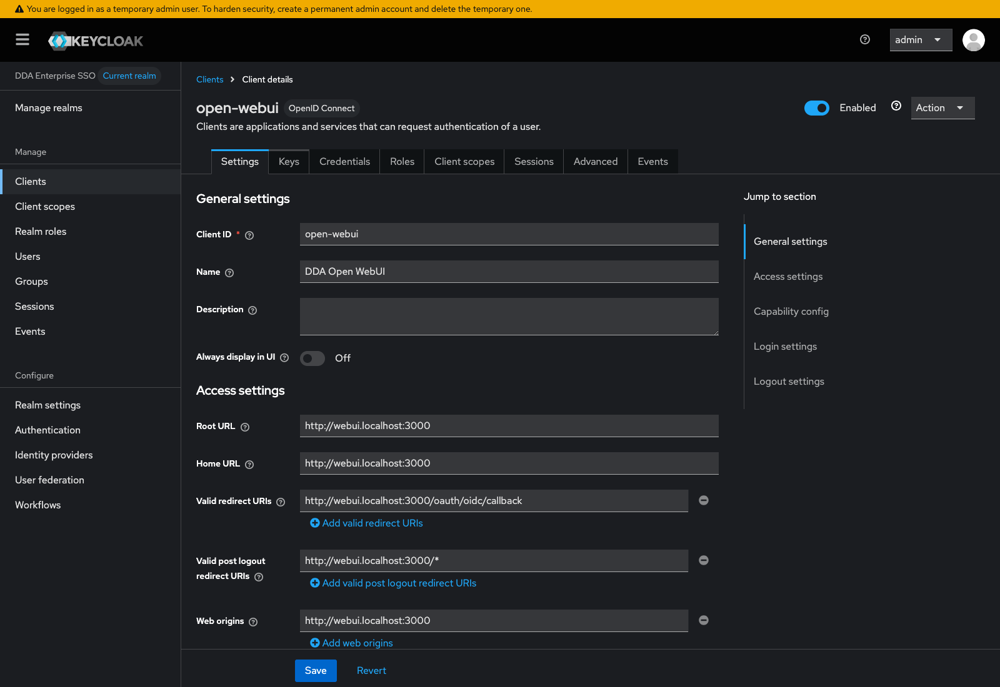

| Setting | Local value |
|---|---|
| Client ID / name | `open-webui` / `DDA Open WebUI` |
| Root / Home URL | `http://webui.localhost:3000` |
| Valid redirect URI | `http://webui.localhost:3000/oauth/oidc/callback` |
| Web origin | `http://webui.localhost:3000` |
| Valid post-logout redirect | `http://webui.localhost:3000/*` |

The authorization callback is exact and has no wildcard. The post-logout pattern is a separate setting and must not be reused as an authorization callback.

### Client capabilities

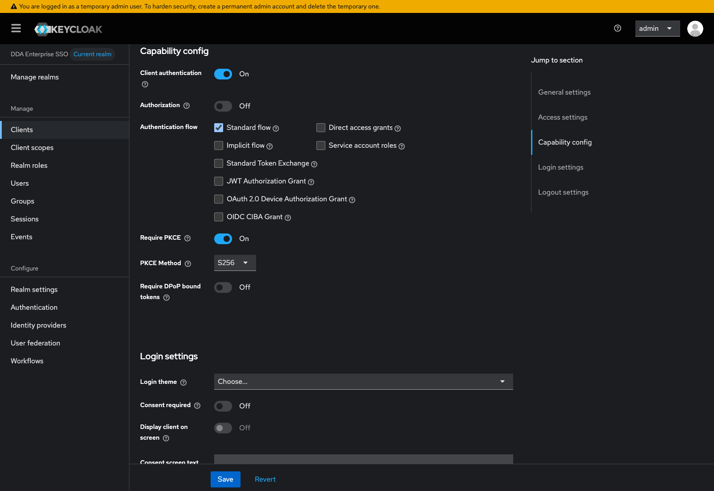

| Capability | Setting |
|---|---|
| Client authentication | On: confidential client |
| Standard flow | On: authorization code |
| Direct access grants | Off |
| Implicit flow | Off |
| Service account roles | Off |
| Require PKCE / method | On / S256 |
| Authorization services | Off; application role mapping does not require this feature |

The client secret is stored privately as `WEBUI_CLIENT_SECRET` and supplied to Open WebUI. It is intentionally absent from the screenshots and exported reference. For rotation, coordinate the Keycloak client credential and WebUI Secret/environment update, restart or roll out WebUI, and verify a fresh login.

### Logout behavior

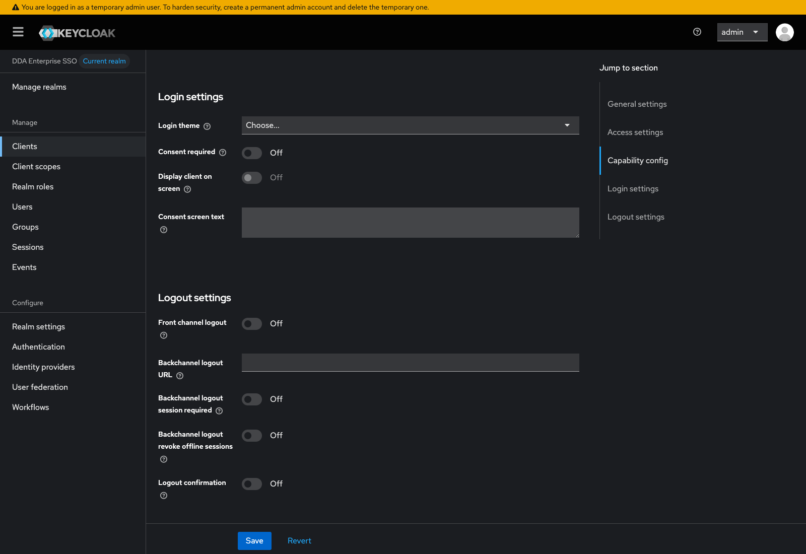

The local setup does not configure a backchannel logout endpoint. Do not equate closing a tab, expiring a Keycloak token, or changing group membership with immediate application-session revocation. For urgent removal, act on WebUI sessions/access and the relevant Keycloak sessions through the approved administrative process.

### Signed role mapper

Navigate to **Clients → open-webui → Client scopes → open-webui-dedicated → Mappers → webui-roles**.

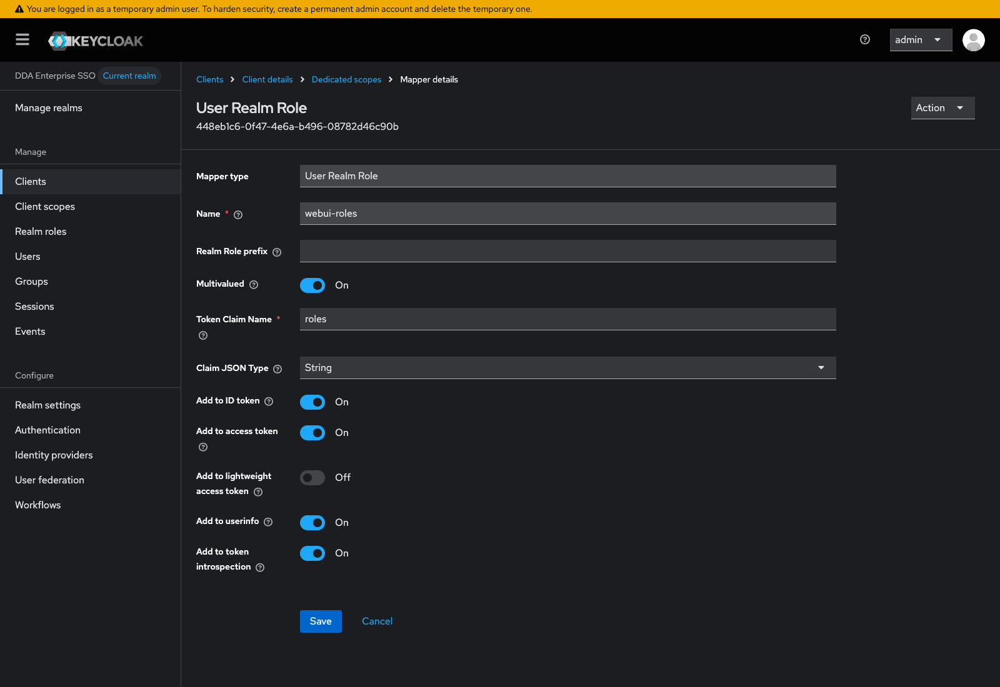

| Mapper field | Value |
|---|---|
| Mapper type | User Realm Role |
| Name | `webui-roles` |
| Token claim name | `roles` |
| Claim JSON type / multivalued | String / On |
| Include in ID token | On |
| Include in access token | On |
| Include in UserInfo | On |

The claim includes inherited realm roles from Keycloak groups. Open WebUI consumes this claim; it does not need to query Keycloak's administration API. Token values are intentionally not included in this guide.

## 6. Keycloak groups and inherited permissions

Navigate to **dda → Groups**.

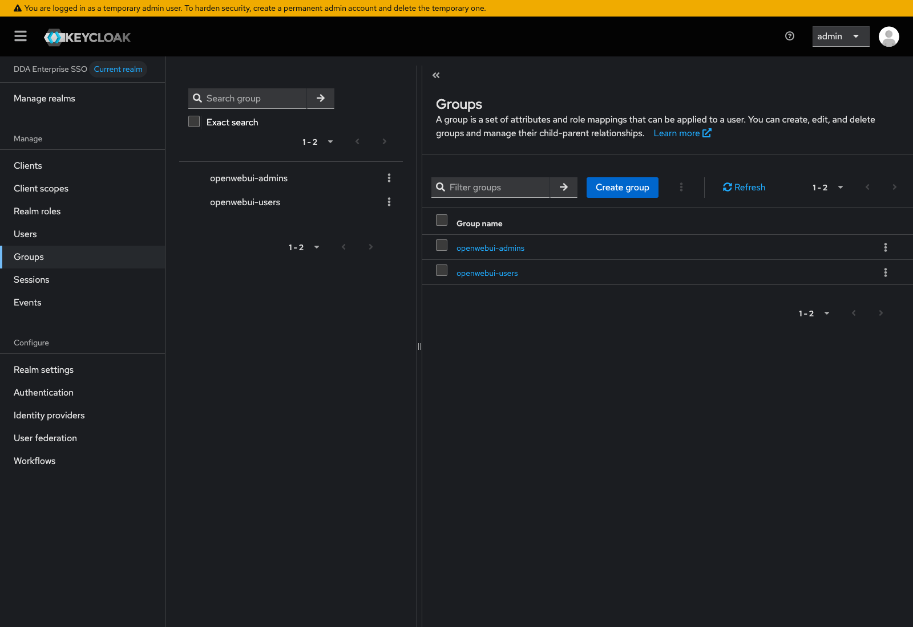

| Keycloak group | Roles assigned to the group | Effective Open WebUI role |
|---|---|---|
| `openweb-users` | `webui-user` | User |
| `openwebui-admins` | `webui-user`, `webui-admin` | Administrator |

The five demo identities are seeded into the user group; the dedicated SSO administrator is seeded into the administrator group. Live membership may change after bootstrap. The reconciliation script migrates the original demo direct grants once and preserves later membership decisions.

Navigate to **Groups → openweb-users → Role mapping**.

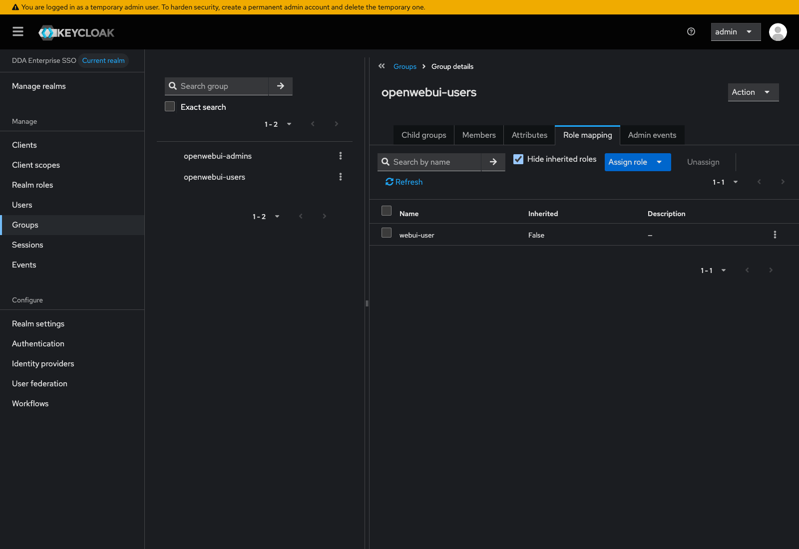

Navigate to **Groups → openwebui-admins → Role mapping**.

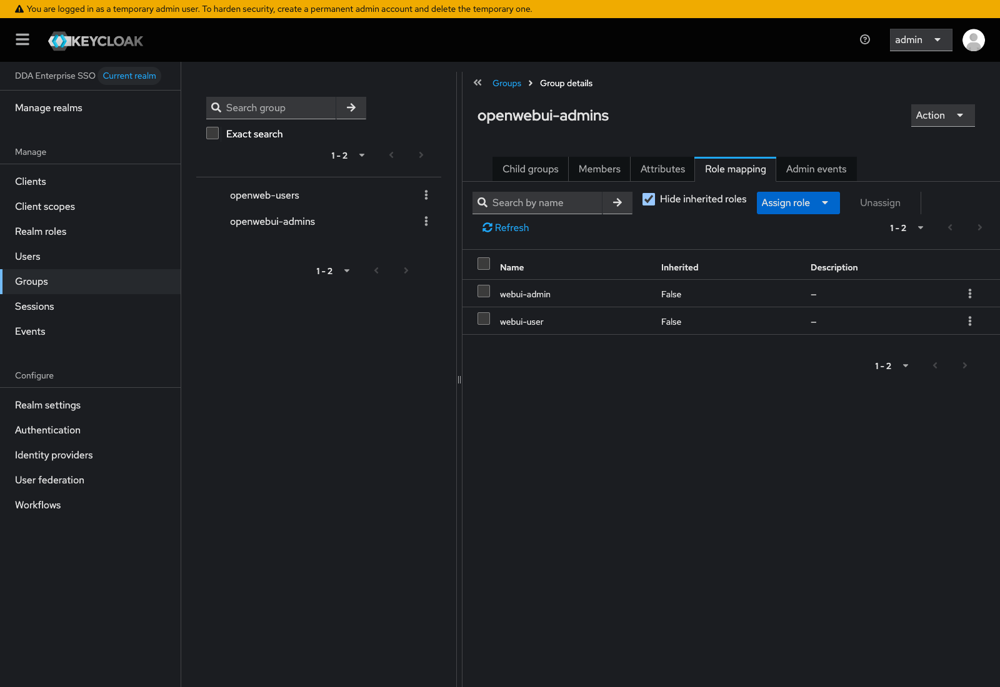

“Inherited: False” in these group screens means the role is assigned directly to the group. Users who join that group inherit the role. Ordinary users should not carry direct `webui-admin` grants. The realm-wide default role no longer grants `webui-user`, so membership is meaningful.

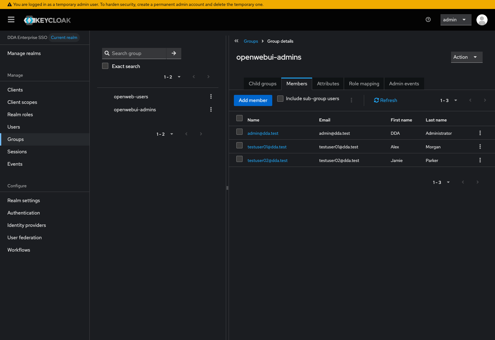

### Add or promote a user

1. Open **dda → Users**, search for the approved identity, and select it.
2. Open **Groups → Join Group** and choose `openweb-users` for ordinary access or `openwebui-admins` for administrator access.
3. Have the user sign out of Open WebUI and select **Continue with DDA SSO** again.
4. Verify the expected WebUI role and the presence or absence of the Admin Panel.

Membership in both groups grants administrator access. Membership in `openwebui-admins` grants WebUI administration only. Keycloak realm administration remains the separate `realm-management/realm-admin` assignment.

### Demote or remove access

1. Remove `openwebui-admins`; retain `openweb-users` for a demotion to ordinary user.
2. Remove both memberships to deny a new SSO login, provided no other direct or inherited allowed role remains.
3. Verify a new sign-in. Existing sessions require separate revocation for immediate removal.

The local [group verification script](../scripts/verify-group-inheritance.py) temporarily promotes `testuser05`, verifies demotion, verifies denial with neither group, and restores the original membership. Its [recorded results](../verification/group-results.json) are a test-run artifact, not continuous monitoring.

## 7. Open WebUI authentication configuration

Sign in as the dedicated administrator. Open **Admin Panel → Settings → Authentication**. In this version, settings appear in a modal with an **Admin / System** section in its left navigation.

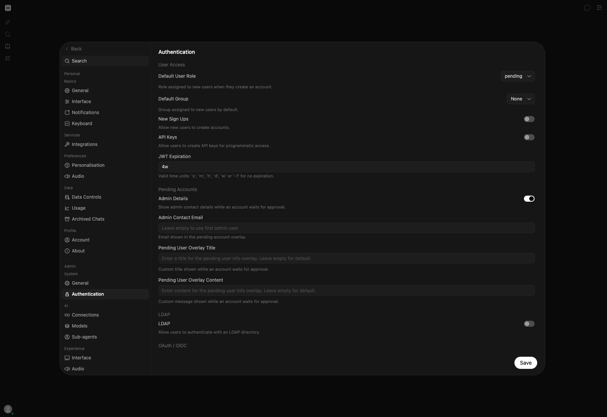

The existing database's **User Access** defaults are persisted settings. In the captured local UI, the default role is `pending`, local New Sign Ups is off, API Keys is off, and application session expiration is `4w`. These are not identical to every environment default. The OAuth sign-up and role-management controls below govern the configured SSO path. Do not confuse local password registration with OAuth account provisioning.

### OIDC trust and account matching

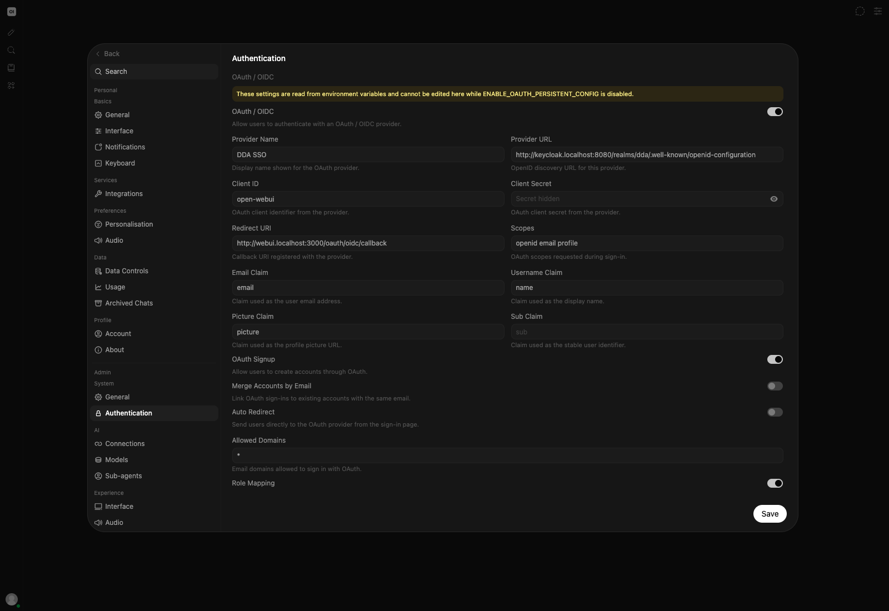

| WebUI setting / environment key | Local value |
|---|---|
| Provider name / `OAUTH_PROVIDER_NAME` | `DDA SSO` |
| Provider URL / `OPENID_PROVIDER_URL` | `http://keycloak.localhost:8080/realms/dda/.well-known/openid-configuration` |
| Client ID / `OAUTH_CLIENT_ID` | `open-webui` |
| Client secret / `OAUTH_CLIENT_SECRET` | Private `WEBUI_CLIENT_SECRET` reference |
| Redirect / `OPENID_REDIRECT_URI` | `http://webui.localhost:3000/oauth/oidc/callback` |
| Scopes / `OAUTH_SCOPES` | `openid email profile` |
| Email / display name / stable subject claims | `email` / `name` / `sub` |
| OAuth signup / `ENABLE_OAUTH_SIGNUP` | On |
| Merge by email / `OAUTH_MERGE_ACCOUNTS_BY_EMAIL` | Off |
| Update name / `OAUTH_UPDATE_NAME_ON_LOGIN` | On |
| Authorization parameters / `OAUTH_AUTHORIZE_PARAMS` | `{"kc_idp_hint":"dex"}` |
| PKCE / `OAUTH_CODE_CHALLENGE_METHOD` | `S256` |

The banner identifies the OAuth settings as environment-managed while `ENABLE_OAUTH_PERSISTENT_CONFIG` is disabled. Make persistent changes in [compose.identity.yaml](../compose.identity.yaml) or the [OpenShift generator](../scripts/render-openshift.py), then recreate/roll out the container. Disabled controls are expected; changing unrelated UI defaults does not override these deployment-owned values.

Auto Redirect is off in the captured UI, preserving the initial **Continue with DDA SSO** choice. The `kc_idp_hint` parameter takes effect after that choice and bypasses the Keycloak provider-selection page.

### Role mapping and the distinction from workspace groups

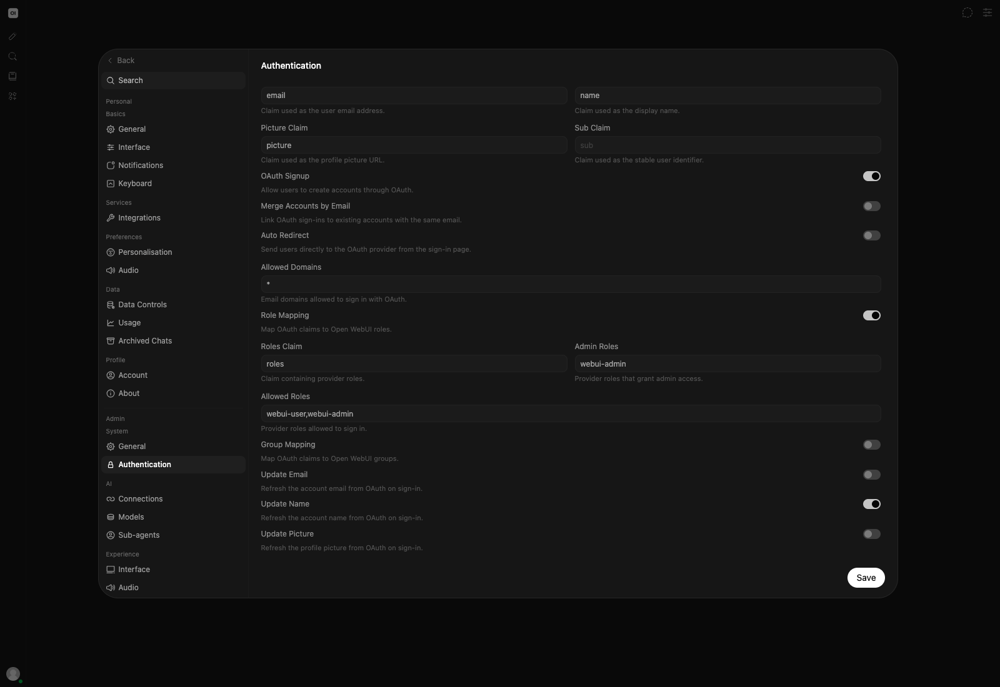

| Setting | Value |
|---|---|
| `ENABLE_OAUTH_ROLE_MANAGEMENT` | `true` |
| `OAUTH_ROLES_CLAIM` | `roles` |
| `OAUTH_ALLOWED_ROLES` | `webui-user,webui-admin` |
| `OAUTH_ADMIN_ROLES` | `webui-admin` |
| OAuth Group Mapping | Off |

The Keycloak group assigns a realm role, the mapper emits that role, and WebUI updates its application role on SSO sign-in. This implementation does not copy the Keycloak groups into Open WebUI workspace groups. Those are a separate mechanism for sharing resources and applying workspace permissions.

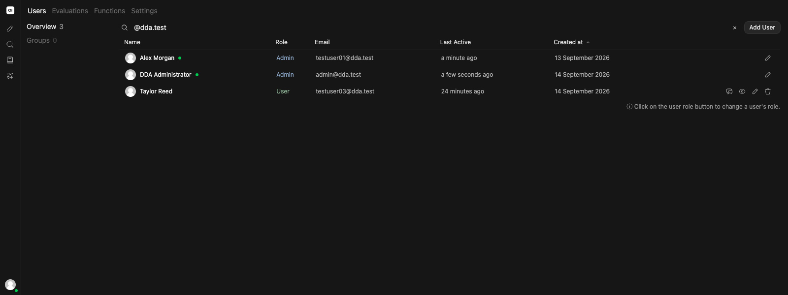

The user list is filtered to synthetic `@dda.test` identities. It illustrates accounts already provisioned at capture time, not a guarantee that every Dex fixture has already signed into this particular WebUI database. The captured example shows Alex Morgan with Admin access and Taylor Reed with User access; it reflects live demonstration changes, not the initial ordinary-user seed policy. Other local accounts and chat content are excluded.

### Model connections are separate from authentication

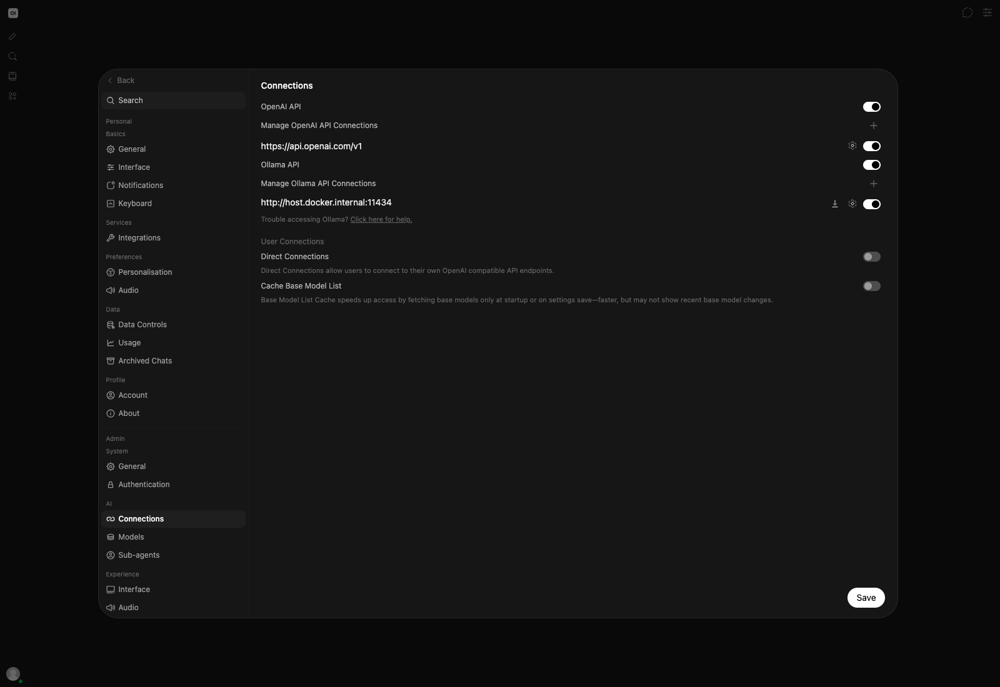

The local connection screen shows an OpenAI-compatible endpoint at `https://api.openai.com/v1` and Ollama at `http://host.docker.internal:11434`. A configured endpoint is not proof of a working model, credentials, or network reachability. SSO can work independently of inference.

For air-gapped OpenShift, point inference at an approved internal service and supply its CA and credentials through private Secrets. Local offline initialization uses `OFFLINE_MODE=true`, `HF_HUB_OFFLINE=1`, and disables version checks. This avoids startup-time model downloads; embeddings require a preloaded model or an approved internal embedding endpoint. Review [Open WebUI deployment notes](../open-webui/README.md).

## 8. Dex login and the five test identities

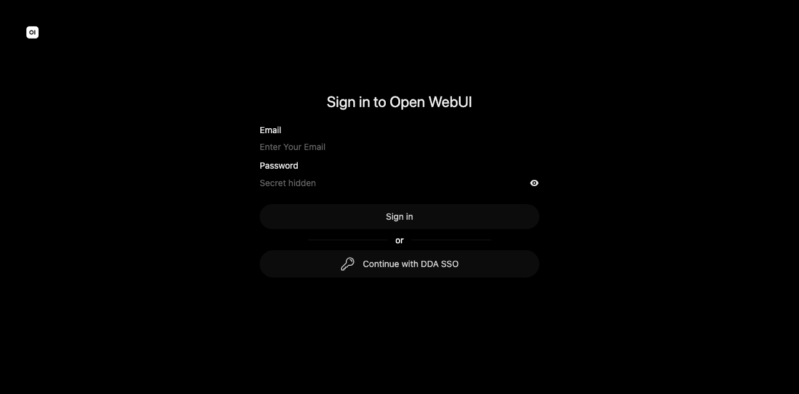

Select **Continue with DDA SSO**. The next interactive login form is Dex.

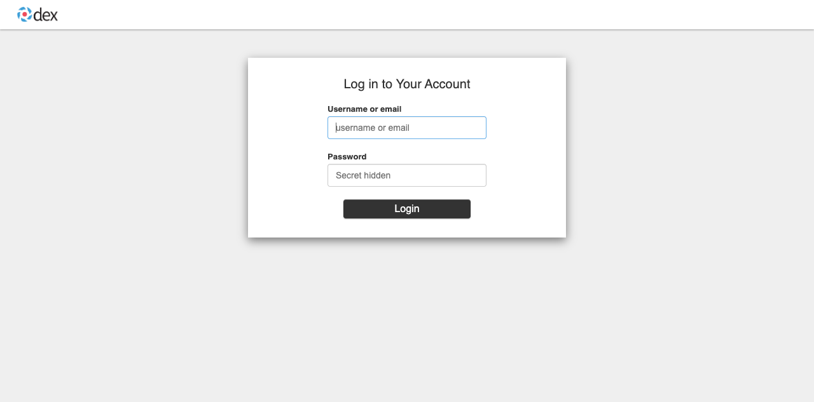

| Username | Dummy email | Profile |
|---|---|---|
| `testuser01` | `testuser01@dda.test` | Alex Morgan |
| `testuser02` | `testuser02@dda.test` | Jamie Parker |
| `testuser03` | `testuser03@dda.test` | Taylor Reed |
| `testuser04` | `testuser04@dda.test` | Jordan Blake |
| `testuser05` | `testuser05@dda.test` | Casey Brooks |
| `admin` | `admin@dda.test` | DDA Administrator |

Passwords remain in the private local credential sheet, never in Git or these screenshots. Either the fixed demo username or its email uses the same password. The browser template maps the six aliases to canonical emails before upstream Dex password verification; it is not a native arbitrary-username API feature. Email login works without the adapter's JavaScript. Changing a fixture alias requires rebuilding the derived Dex image.

Dex's static-password `username` field supplies the full display name. Its stable `userID` supplies the identity subject. Do not create duplicate records to support alternate login spellings. For enterprise LDAP/AD or another OIDC source, use the real connector's supported username mapping and remove the demo adapter/static passwords.

## 9. Reproduce locally and carry changes to OpenShift

| Concern | Local Mac | Air-gapped OpenShift |
|---|---|---|
| Public URLs | Loopback ports and `.localhost` aliases | HTTPS Routes and enterprise DNS |
| Realm TLS requirement | Local override `none` | `external`, with HTTPS Routes |
| Keycloak startup | Development mode | Optimized derived image and production startup |
| Certificates | Local HTTP demo | Enterprise TLS certificate and CA trust |
| Identity fixtures | Five synthetic users plus separate SSO administrator | Opt-in `--with-demo-users`; replace with enterprise IdP for production |
| Secrets | Ignored `.runtime/` files | Private generated Secrets / approved secret-management process |
| WebUI local login form | Visible for local administration | Disabled by default; controlled temporary enablement for recovery |
| Data | Named Docker volumes | PVCs and backup/restore plan |
| Image delivery | Local Docker images | Export archive, checksum, private registry and pinned destination digests |
| Availability | Single-replica demo | Reference is also single replica; HA requires a validated design |

### Configuration-to-source map

| Configuration | Source of truth | OpenShift artifact |
|---|---|---|
| Realm, broker, groups, role mapper, demo federation | `scripts/bootstrap.py: realm()` | `openshift/reference/keycloak/keycloak-realm.yaml` |
| Live local Keycloak reconciliation | `scripts/sync-keycloak.py` | Use controlled Admin API/console or enterprise reconciliation; restart imports do not update existing realms |
| Dex clients, issuer, identities, storage | `scripts/bootstrap.py: dex_config()` | `openshift/reference/dex/dex-config.yaml` |
| Dex username form | `dex/Dockerfile`, `dex/theme/password.html` | Same derived Dex image mirrored into the internal registry |
| WebUI OIDC and role settings | `compose.identity.yaml`, `scripts/render-openshift.py` | `openshift/reference/open-webui/` |
| Routes, Services, probes, security contexts, NetworkPolicies, PVCs | `scripts/render-openshift.py` | `openshift/reference/` |
| Image provenance and mirroring | `images.lock.json`, component Dockerfiles, export/import scripts | Approved destination registry digests |

### Local change workflow

1. Back up the existing platform using the [recovery runbook](RECOVERY.md).
2. Edit the relevant generator, Compose file, or template. Do not place secrets in source.
3. Run `python3 scripts/bootstrap.py` to preserve existing credentials and regenerate private local files.
4. Use `python3 scripts/sync-keycloak.py` for an existing local realm. Keycloak startup imports run only for a missing realm.
5. Rebuild Dex if its template changed; recreate affected services with `scripts/local.sh up -d --build`.
6. Test username/email login, expected roles, group promotion/demotion and invalid-login behavior using the scripts below.
7. Refresh documentation evidence only after verifying the resulting state.

```sh
make validate
python3 scripts/onboard-test-users.py --username
python3 scripts/onboard-test-users.py
python3 scripts/onboard-test-users.py --admin --username
python3 scripts/check-login-rejection.py
python3 scripts/verify-local.py
# Local demo only: temporarily changes testuser05 membership and restores it.
python3 scripts/verify-group-inheritance.py
python3 scripts/export-config-reference.py
```

For image export/import, Route parameters, CA handling and acceptance checks, follow [AIRGAP.md](AIRGAP.md). Generated real-secret manifests stay in ignored `openshift/rendered/`; committed `openshift/reference/` contains placeholders. Reference manifests have been rendered and checked, not deployed or validated on a live enterprise cluster.

## 10. Troubleshooting and operations

| Symptom | What to inspect | Expected resolution |
|---|---|---|
| Keycloak login page instead of Dex | WebUI authorization parameters and broker alias | Preserve `kc_idp_hint=dex` and alias `dex` |
| Second profile form | Broker first-login flow, full upstream name/email | Use `dda-first-broker-login`; verify complete profile claims |
| Existing email already registered | Keycloak user ID versus the stored WebUI `oidc.sub` | Restore the original identity or explicitly verify/reconcile the fixture link; see `repair-demo-links.py` and recovery runbook |
| Newly added group does not change UI | New SSO token, inherited roles, role mapper and WebUI role policy | Sign out/in, inspect membership and mapper; do not assume instant session revocation |
| User stays admin after leaving admin group | Other direct/inherited roles, existing WebUI session | Remove bypass grants and apply the session-revocation process |
| Group names absent from WebUI Groups | Role mapping versus workspace-group synchronization | Expected in this design; application roles are inherited, workspace groups are not mirrored |
| OIDC controls disabled | Environment ownership banner | Change deployment configuration and roll out, not the read-only controls |
| Dex username fails but email works | Derived image, frontend directory and alias template | Build `dex/Dockerfile`, use `/srv/dex/web`, verify the fixed alias list |
| Login redirect or signature error | Exact URI, issuer, CA, JWKS, DNS and time | Correct trust/network configuration; do not disable signature validation |
| WebUI waits during startup | Offline initialization and embedding model availability | Use approved cached artifacts/internal service; inspect startup logs |
| Sign-in works but no models appear | Model provider URL, credentials and reachability | Diagnose inference independently of SSO |

Back up Dex signing/session storage, the Keycloak PostgreSQL database, the WebUI data volume, and protected configuration together. Preserve stable identity IDs. Restore into an isolated environment and verify issuer/redirect URLs before use. Refer to [RECOVERY.md](RECOVERY.md), [ADMINISTRATION.md](ADMINISTRATION.md), [SECURITY.md](../SECURITY.md) and [PRODUCTION-READINESS.md](PRODUCTION-READINESS.md).

## 11. Screenshot maintenance and scope

These are real application screenshots, not mockups. Secret controls were masked in the rendered browser DOM without submitting settings. The public login screenshots use empty fields. The user-list example is restricted to synthetic identities. Console internal IDs, labels and counts may change on another bootstrap.

To refresh: sign in with the approved local administrator, use the named menus in this guide, wait for the correct realm/group heading and loaded values, hide secret fields before capture, review the image and OCR output, then replace its corresponding file under `docs/screenshots/`. Never capture the raw private credential sheet, browser storage, token responses, personal users, chats, or private-key screens. Keep authenticated raw recordings under ignored `verification/`.

The [screenshot manifest](screenshots/manifest.json) records filenames, hashes and review scope. Refresh the [non-secret configuration export](configuration/local-effective-config.json) using its script, and rebuild the standalone HTML preview with `python3 scripts/render-configuration-guide.py`. No CDN or online font is needed to view the HTML and adjacent screenshots offline.
